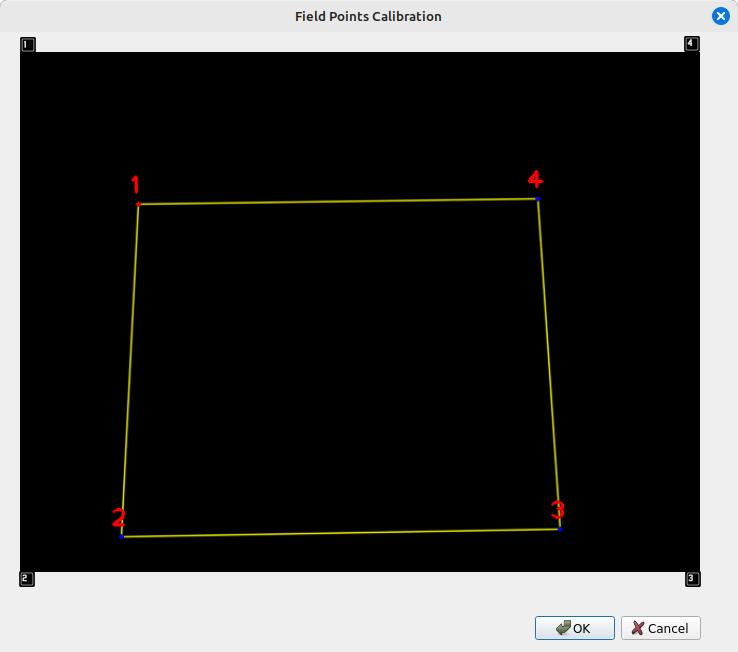

# 2.Configurando o Campo


### 1. Inicie o Titans-Vision

Abra o terminal e execute o seguinte comando:

```bash
./docker_run [ID da câmera]
```

> 🔍 **Nota:** O **ID da câmera** pode ser encontrado em `/dev/video {id}`.  
> Por exemplo: `/dev/video 0` → ID = `0`  
>  
> ❗ Se nenhum ID for especificado, o sistema será executado **sem uma câmera conectada**.


---

### 2. Acesse a Interface Gráfica

Assim que o sistema iniciar, será exibida a interface gráfica principal.  
Clique no  **Start Capture Button** para o sistema começar a capturar as imagens do campo.

---

### 3. Acesse a Interface Gráfica

Depois clique no  **Field Points Calibration Button** para o sistema começar a configurar a localização do campo na imagem.

---

### 4. Ajuste dos Pontos do Campo

Após clicar na configuração do campo, uma nova janela será aberta mostrando a imagem capturada pela câmera, com **quatro pontos sobrepostos** — um para cada canto do campo.



🔹 Próximo de cada ponto, você verá uma **tecla do teclado** indicada ( 1, 2, 3, 4).  
Essas teclas representam os **quatro cantos do campo**.

#### 📍 Como ajustar os pontos:

1. **Pressione a tecla `Alt` no teclado.**
2. **Enquanto mantém o `Alt` pressionado, pressione a tecla com o número que corresponde ao ponto que você quer mover.**
   - Por exemplo:  o ponto inferior está marcado com `2`, pressione `Alt + 2`.
3. Agora, use as teclas `W`, `A`, `S`, `D` para **mover o ponto na imagem**:
   - `W` → cima  
   - `A` → esquerda  
   - `S` → baixo  
   - `D` → direita

📝 **Dica:** Ajuste os pontos até que cada um deles esteja posicionado exatamente nos **quatro cantos reais do campo** que está sendo projetado pela câmera.

---

### 4. Salvar Configuração

Após ajustar todos os quatro pontos:

- Clique na opção **Ok** para armazenar a posição dos pontos.

✅ Agora o sistema está calibrado com os cantos corretos do campo.

