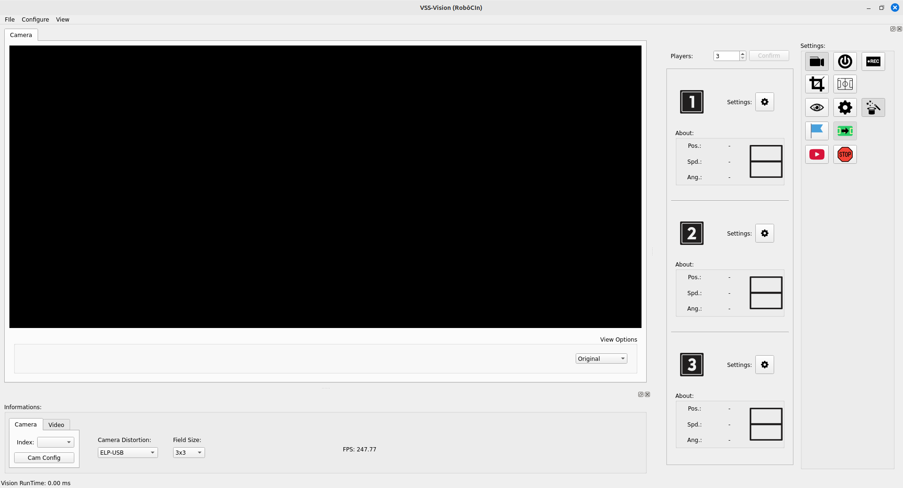
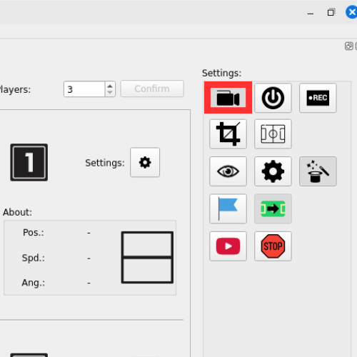

# 1. Installation Guide

This guide explains how to clone, configure, and run the **Titans Vision** system, either using **Docker** or by manually compiling on **Ubuntu 22.04 LTS**.

---

## 🐳 Option 1: Using Docker (recommended)

1. **Clone the repository:**

   Open the terminal and run:
   ```bash
   git clone https://github.com/team-titans-unb/titans-vision
   ```

2. **Navigate to the project directory:**
   ```bash
   cd titans-vision
   ```

3. **Build the Docker image:**

   This script creates the Docker image with all dependencies configured.
   ```bash
   ./docker_build
   ```

4. **Run the system:**

   Use the command below to run the system. Replace `[Camera ID]` with the corresponding camera number (e.g., `0` for `/dev/video0`).
   ```bash
   ./docker_run [Camera ID]
   ```

   🔎 **Note:**  
   The Camera ID can be found at `/dev/video{id}`.  
   If you do not provide an ID, the system will run **without using a connected camera**.



5. **Start field capture:**

   After the graphical interface opens, click the **“Start Capture”** button to begin capturing the field view.



---

## 🛠️ Option 2: Manual Compilation (Ubuntu 22.04 LTS)

If you prefer or need to compile the project manually, follow the instructions below:

### 1. Install required dependencies

From the project root directory, run:
```bash
./InstallDependencies
```

This script will install all libraries and tools required by the system.

### 2. Compile the project using CMake

In the terminal:

```bash
# From the root of the repository
mkdir build
cd build
cmake ..
make
```

This process will create the binary files inside the `build` directory.

### 3. Run the system

From the project root, run:

```bash
cd src
./VSS-VISION
```
