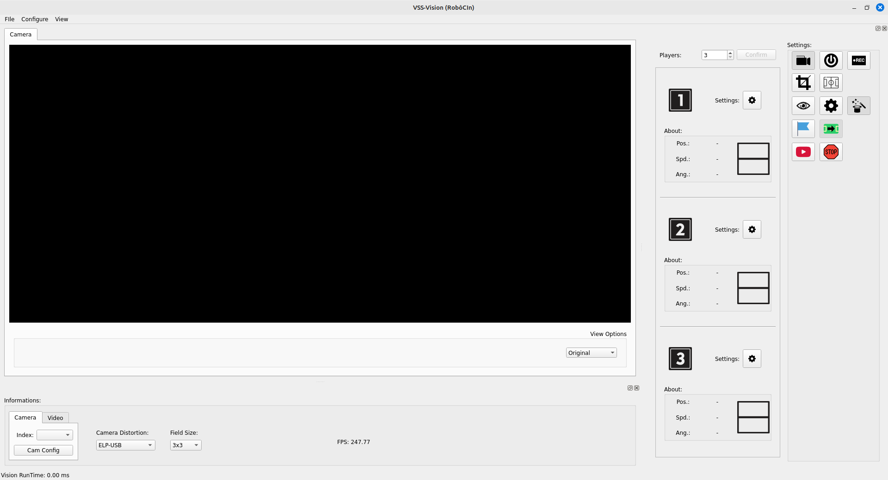
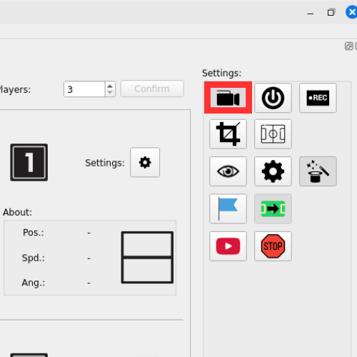
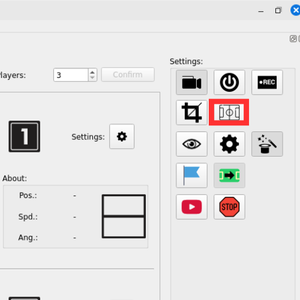

# 2. Setting Up the Field

### 1. Start Titans-Vision

Open the terminal and run the following command:

```bash
./docker_run [Camera ID]
```

> 🔍 **Note:** The **Camera ID** can be found at `/dev/video {id}`.
> For example: `/dev/video 0` → ID = `0` 
> ❗ If no ID is specified, the system will run **without a connected camera**.



---

### 2. Access the Graphical Interface

Once the system starts, the main graphical interface will appear. 
Click the **Start Capture Button** to begin capturing images from the field.



---

### 3. Access the Calibration Interface

Then click the **Field Points Calibration Button** to begin setting up the field’s position in the image.



---

### 4. Adjusting Field Points

After clicking to configure the field, a new window will open showing the image captured by the camera, with **four overlaid points** — one for each corner of the field.


🔹 Near each point, you will see an associated **keyboard key** (1, 2, 3, 4). 
These keys represent the **four corners of the field**.

#### 📍 How to adjust the points:

1. **Hold down the `Alt` key on your keyboard.**
2. **While holding `Alt`, press the number key corresponding to the point you want to move.**
   - Example: If the bottom point is marked with `2`, press `Alt + 2`.
3. Now, use the `W`, `A`, `S`, `D` keys to **move the point in the image**:
   - `W` → up 
   - `A` → left 
   - `S` → down  
   - `D` → right

📝 **Tip:** Adjust the points until each one is exactly positioned at the **real four corners of the field** as projected by the camera.

---

### 5. Save Configuration

After adjusting all four points:

- Click the **Ok** button to save the point positions.

✅ The system is now calibrated with the correct corners of the field.

