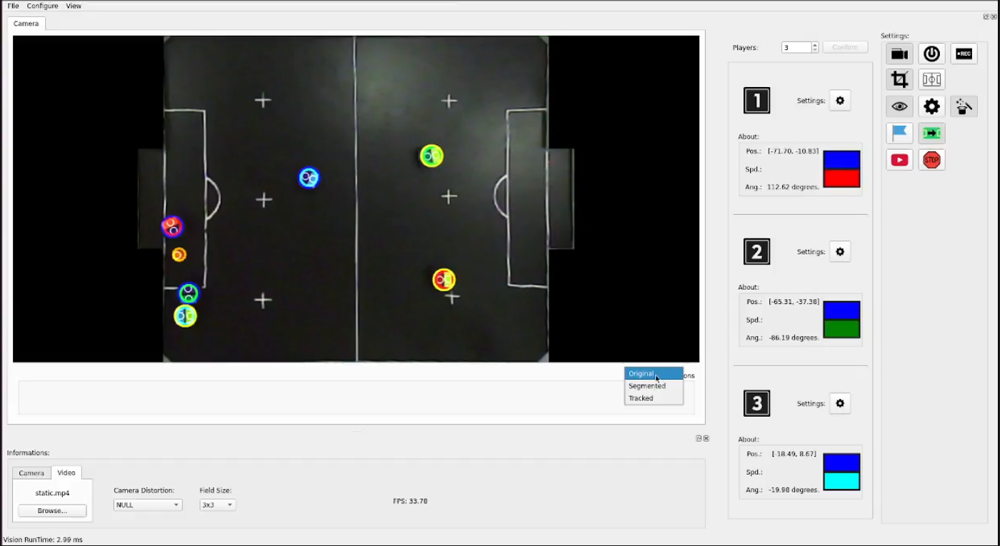
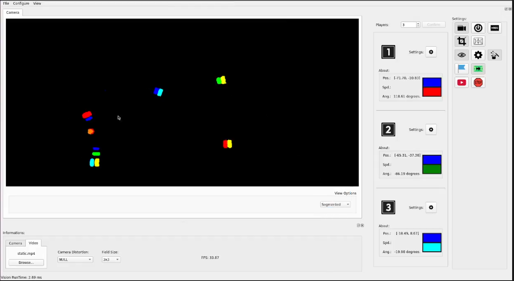
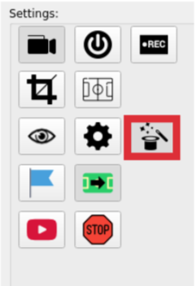
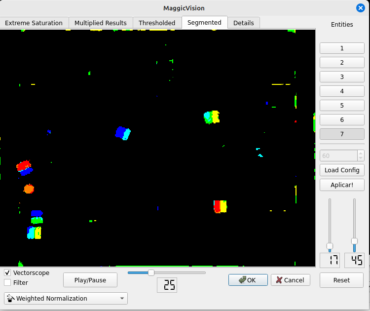
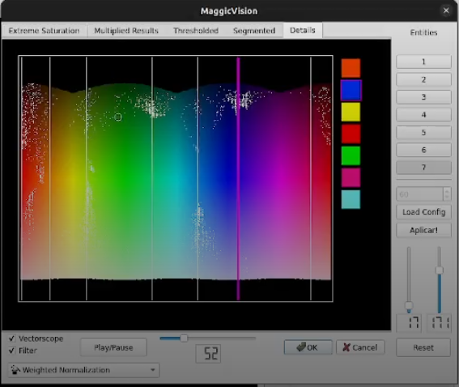
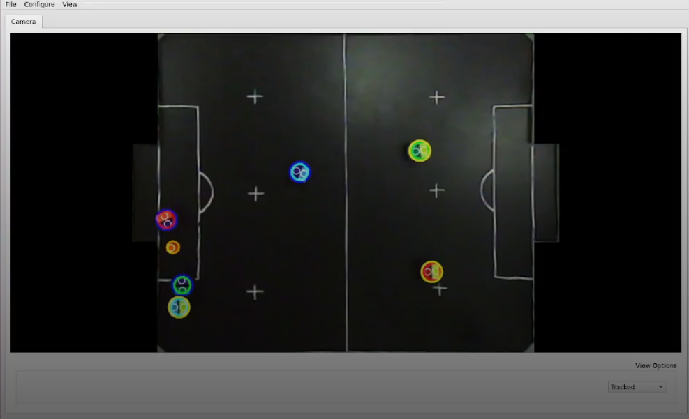
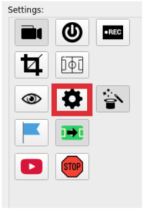
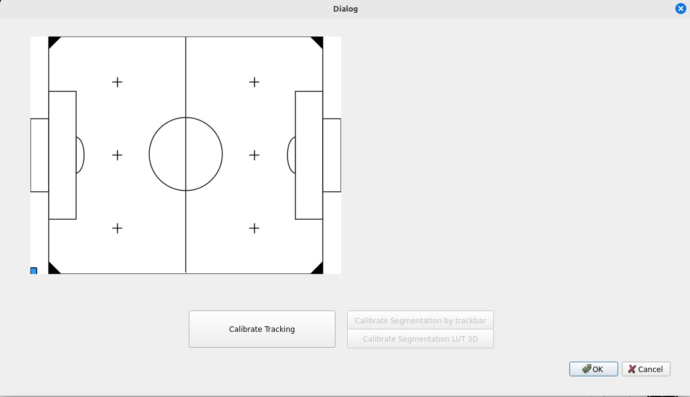
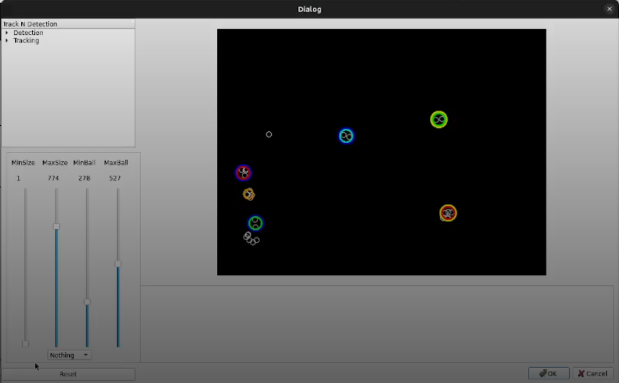

# 3.Color Configuration Guide – Titans-VISION

## **Overview**

This document provides a step-by-step guide to configuring the **Titans-VISION** system for optimal object detection and tracking. It covers how to fine-tune color segmentation, adjust object detection size filters, and verify accurate tracking of robots and the ball on the field.

## **1\. Starting the Vision System**

After launching **Titans-VISION**, activate **Field Capture Mode**. At the bottom of the camera preview, change the image mode from **Original** to **Segmented**.

*I* 

This allows you to view only the elements detected by the vision system (robots and ball), filtering out unnecessary data or image noise.

🎯 **Goal:** Only robots and the ball should appear in the segmented view, with minimal false positives.

## **2\. Opening the Color Segmentation Tool**

Navigate to the menu bar and click on **MagicVision**. 

 

After this open the **Segmented** tab, where you'll configure how the system interprets colors and detects "blobs" (visual representations of objects).

 

## **3\. Entity Detection Configuration**

On the right side of the screen, under **Entities**, you can set how many objects the system should detect — such as the ball and the robots (in the example image, 7 entities). Below that, you’ll see options to fine-tune which objects should or shouldn't be detected.

**The objective is for the system to detect all the tags and robots as accurately as possible**. 
 Keep in mind: these settings vary depending on the lighting conditions and the specific field setup, so they must be adjusted early on.

* Click **Apply** under *Entities* to preview the new configuration.

* Click **OK** (green arrow) to save.

## **4\. Using the Vectorscope (Advanced Color Tuning)**

If the system is misidentifying colors like in the previous image (e.g., confusing light blue with green), go to the **Details** tab and enable the **Vectorscope below the screen**.

This will display a color spectrum graph where each line corresponds to a detected color.

You’ll see several **white points** appear — these represent the colors the system is detecting. Each **line** in the graph corresponds to one detected color.

To find out which color a line represents, **right-click** on the line. On the side panel, the corresponding color will be highlighted:

 

You can **drag and reposition these lines** to change how the system interprets each color. 
 For example, if you swap the **orange** and **green** lines, the system will show the ball as green in the segmented tab. 
 This is useful when the system has difficulty detecting specific colors correctly.

## **5\. Adjusting Blob Size Filters**

Still in the initial camera tab, aside from **Original** and **Segmented**, there’s also a **Tracked** mode, which shows the objects the camera is currently tracking:

 

To configure the **minimum and maximum size of objects (blobs)** the system should consider valid:

1. Click the **settings button** to open the configuration menu.

  

2. In the new window, click on the **Calibrate Tracking** button.

 

This will open another tab where you can **set the minimum and maximum size** of blobs that the system should interpret as valid objects. 
 Once you’re done, click **OK** to save the settings.

 

---

## **6\. Validation**

Return to the **Segmented** or **Tracked** view and verify that:

* All robots and the ball are detected correctly.

* No false objects are being captured.

* Tracking is consistent as objects move.

Adjust parameters as needed to improve performance, especially when field conditions change (e.g., different lighting or backgrounds).
